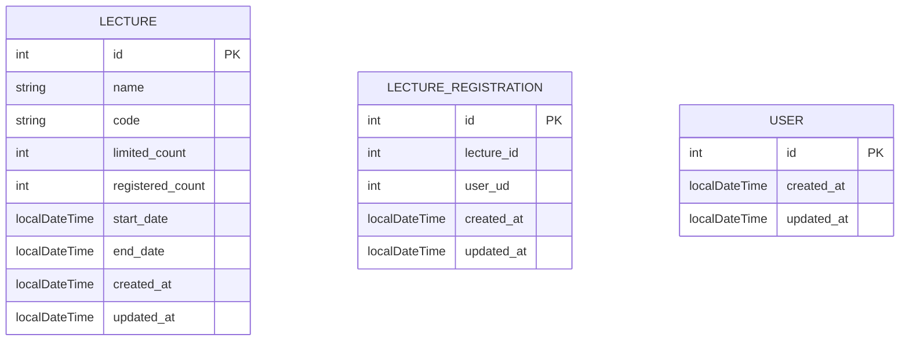

## 특강 신청 서비스

**[ 요구사항 ]**

- [X] POST `/lectures/apply` : 특강 신청 API
    - [X] 동일한 신청자는 한 번의 수강 신청만 성공할 수 있다.
    - [X] 특강은 2024년 4월 20일 토요일 1시에 열린다.
    - [X] 선착순 30명안에 신청하지 못한 신청자는 요청에 실패한다.
    - [X] 어떤 유저가 특강을 신청했는지 히스토리를 저장한다
- [X] GET `/lectures/application/{userId}` : 특강 신청 완료 여부 조회 API
    - [X] 특강 신청에 성공한 사용자는 성공, 등록자 명단에 없는 사용자는 실패를 반환한다.
- [X] GET `/lectures` : 특강 선택 API
    - [X] 날짜 별 여러 특강을 조회할 수 있다.
    - [X] 특강 인원은 30명으로 고정이다.

**[ ERD ]**

